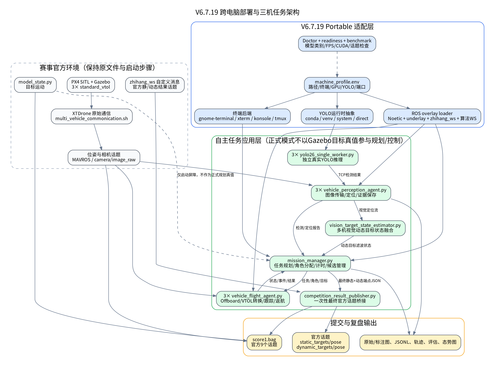
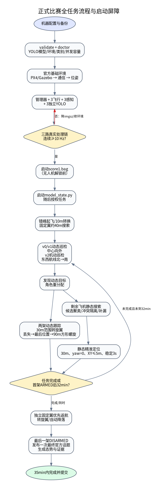

# 智航三机自主搜索系统 V6.7.19 Portable
## 跨电脑部署、YOLO真实运行、竞赛任务执行与交付说明书

**版本：** V6.7.19 Portable  
**模板基线：** V6.7.18  
**目标平台：** Ubuntu 20.04、ROS Noetic、Gazebo 11、PX4 SITL、XTDrone、3架standard_vtol  
**适用任务：** XH-202632“无人机集群自主协同识别与态势融合”仿真任务  
**文档性质：** 安装说明、系统设计说明、运行手册、赛前检查表和故障处理手册

---

## 1. 交付目标与设计原则

V6.7.19不是重新设计V6.7.18的搜索与控制算法，而是在其已验证逻辑外增加一层可移植部署框架，使同一套代码能够迁移到不同用户名、目录结构、ROS工作空间、显卡数量、显存大小、YOLO环境和终端程序的Ubuntu电脑。

本版本遵循六项原则：

1. **赛事官方环境优先。** PX4模型、Gazebo模型、world、赛事launch、XTDrone通信、位姿脚本、`model_state.py`和`zhihang_ws`继续使用赛方原件。
2. **修改工程前先备份。** 安装脚本先备份现有算法ROS包，再编译覆盖；用户手工操作也必须先执行本手册的备份命令。
3. **正式模式视觉闭环。** Gazebo目标真值不进入目标定位、规划、任务分配或飞行控制；其仅按官方要求记录进`score1.bag`。
4. **三个真实YOLO链路独立。** 每架无人机拥有独立感知代理、YOLO进程、端口、性能状态和日志，任一链路未达到持续10Hz，正式任务不越过启动屏障。
5. **第一次官方消息就是最终结果。** 评分系统以官方话题第一次接收消息为准，因此本系统在全部任务结束后只发布一次整理后的静态和动态目标结果。
6. **安全落地优先。** 搜索到32分钟立即进入返航，预留3分钟；即使总时间超过35分钟，程序只告警而不中止返航和降落监督。



---

## 2. 赛事要求基线

本节依据用户提供的《2026年度中国青年科技创新“揭榜挂帅”擂台赛——XH-202632 无人机集群自主协同识别与态势融合参赛选手手册》归纳。若后续赛方发布修订版，以最新官方文件为准。

### 2.1 环境与自主性

- 操作系统为Ubuntu 20.04，仿真平台为Gazebo，机器人系统为ROS1。
- 使用3架无人机，在复杂野外环境中自主完成搜索、识别、定位、态势生成和指定区域降落。
- 全流程无需人工参与。
- 官方文件必须按规定位置部署，比赛期间不得随意关闭或重启官方进程。

### 2.2 目标集合

静态目标模型共6类：

- `prius_hybrid`
- `car_lexus`
- `car_opel`
- `person_white`
- `prius_hybrid_camo`
- `fire_truck`

科目一发布时，其类别均为`static_target`。动态目标共2类：

- `suv_camo`
- `person_red`

科目二态势图和动态结果需保留动态目标模型名。

### 2.3 官方结果话题

静态话题：

```text
/zhihang2026/static_targets/pose
```

动态话题：

```text
/zhihang2026/dynamic_targets/pose
```

外层消息包含`header_timestamp`和`categories`；每条结果包含：

```text
timestamp
model_name
x
y
```

每个话题最多20条结果，评分以系统第一次接收到的消息为准。V6.7.19在任务完成后从最终结果生成一次性消息：静态目标优先采用悬停精确定位，未完成精确定位时采用当前最高置信度的可用检测定位；动态目标优先采用完整轨迹的首末端点，缺少本机轨迹时可使用可靠的跨机注入或最近视觉定位作为末端保底。静态结果最多6条，动态起止端点最多4条。若一个结果分量为空而另一个有效，仍发布两类官方消息，以保住有效分量得分；只有静态和动态结果同时为空时才拒绝发布。

### 2.4 计时和定位评分约束

- 计时从第一架飞机在起飞区域内`armed`开始，到最后一架在降落区域内`disarmed`结束。
- 总门限为35分钟。
- 静态定位距离在水平面计算，定位误差达到10m时该目标定位项为0。
- 系统内部精确定位控制目标设置为XY误差不超过5m，以给定位评分留出余量。

### 2.5 score1.bag

官方要求在无人机起飞前开始记录，并包含以下9个话题：

```text
/standard_vtol_0/mavros/state
/standard_vtol_1/mavros/state
/standard_vtol_2/mavros/state
/gazebo/model_states
/xtdrone/standard_vtol_0/cmd
/xtdrone/standard_vtol_1/cmd
/xtdrone/standard_vtol_2/cmd
/zhihang2026/static_targets/pose
/zhihang2026/dynamic_targets/pose
```

V6.7.19的正式一键脚本在三路YOLO准备完成后，先启动bag，再启动目标运动，再授权管理器解锁，因此仍满足“起飞前记录”。

赛事要求与代码位置的逐项映射见`COMPETITION_COMPLIANCE_MATRIX.md`。

---

## 3. 版本结构与模块职责

### 3.1 官方环境层

本层由赛方或既有环境提供，本包不覆盖：

- PX4 SITL和赛事Gazebo场景；
- `multi_vehicle_commonication.sh`或环境中同义通信脚本；
- 位姿真值转发脚本；
- 三路相机话题；
- `model_state.py`；
- `zhihang_ws`自定义消息；
- QGroundControl。

### 3.2 Portable适配层

| 模块 | 作用 |
|---|---|
| `machine_profile.env` | 保存本机所有路径、终端、YOLO、GPU和端口参数 |
| `configure_portable_machine.py` | 自动检测并生成profile和检测报告 |
| `load_machine_profile.sh` | 为所有脚本统一加载profile |
| `source_zhihang_ros_env.sh` | 按正确顺序加载Noetic、underlay、`zhihang_ws`和算法工作空间 |
| `terminal_launcher_common.sh` | 选择图形终端或tmux并保持终端日志可见 |
| `yolo_runtime_common.sh` | 封装conda、venv、system和direct Python |
| `setup_yolo_runtime.sh` | 创建/安装/验证YOLO运行环境 |
| `doctor_portable.sh` | 检查路径、ROS、官方消息工作空间、模型、CUDA、端口和配置 |
| `benchmark_three_yolo_capacity.sh` | 并发加载3个模型实例，评估本机三路推理容量 |
| `export_yolo_runtime_manifest.sh` | 导出软件版本、GPU信息、pip freeze、模型SHA-256 |

### 3.3 自主任务应用层

#### mission_manager.py

负责：

- 生成三机差异化航线；
- 任务启动屏障；
- 动态/机动/静态角色管理；
- 动态目标任务分配、临时锁定和回滚；
- 静态候选聚类、冲突隔离、精准验证排序；
- 32+3分钟计时；
- 统一返航指令；
- 最终结果、评估和态势数据汇总；
- 生成一次性官方结果JSON。

#### vehicle_flight_agent.py

每架飞机各运行一个，负责：

- Offboard预发送、解锁、起飞和VTOL转换；
- 固定翼航段直线巡航；
- 动态目标截获、旋翼跟踪和重捕获；
- 静态目标固定翼接近、旋翼精准悬停；
- HOLD/OFFBOARD异常恢复；
- 固定翼无效零速度setpoint保护；
- 固定翼优先独立返航、转旋翼和自动降落。

#### vehicle_perception_agent.py

每架飞机各运行一个，负责：

- 接收相机图像并发送给本机YOLO进程；
- 处理检测框；
- 相机投影和目标地面定位；
- 多帧有效性、置信度和空间一致性判断；
- 保存原始图像、标注图和误检/候选证据；
- 输出感知FPS、检测报告和定位报告。

#### yolo26_single_worker.py

每架飞机一个独立进程：

- 通过TCP接收JPEG图像；
- 运行真实YOLO权重；
- 返回类别、置信度和检测框；
- 支持`auto/cpu/GPU编号`设备；
- 支持640、512、416自适应输入尺寸；
- 运行时不支持`quantize`参数时自动退回标准推理；
- 独立记录FPS和日志。

#### vision_target_state_estimator.py

正式模式下融合多机视觉定位报告，形成动态目标状态流。它不订阅Gazebo目标真值。

#### competition_result_publisher.py

- 从管理器接收最终静态和动态结果JSON；
- 从已source的`zhihang_ws`中发现具备指定字段结构的自定义消息类型；
- 也允许在YAML中显式指定消息类型；
- 只发布第一次、也是最终一次官方静态/动态话题；
- 记录`competition_topic_publish_evidence.json`作为提交证据。

---

## 4. 支持的电脑配置

### 4.1 推荐正式比赛配置

- Ubuntu 20.04桌面；
- NVIDIA GPU，CUDA版PyTorch；
- 16GB以上内存；
- SSD；
- 单GPU显存建议8GB或以上；
- 三路相机约20Hz，三路处理链持续10Hz以上。

单GPUprofile：

```bash
export ZHIHANG_YOLO_DEVICES="0,0,0"
export ZHIHANG_YOLO_QUANTIZE="16"
export ZHIHANG_YOLO_ADAPTIVE="1"
export ZHIHANG_YOLO_ADAPTIVE_SIZES="640,512,416"
```

### 4.2 双GPU或三GPU

双GPU示例：

```bash
export ZHIHANG_YOLO_DEVICES="0,1,1"
```

三GPU示例：

```bash
export ZHIHANG_YOLO_DEVICES="0,1,2"
```

每个YOLO进程独立加载模型，因此多GPU可以降低互相抢占和显存峰值。

### 4.3 低显存GPU

优先按以下顺序处理：

1. 保持三个独立进程，启用自适应尺寸；
2. 将初始尺寸改为512：

```bash
export ZHIHANG_YOLO_ADAPTIVE_SIZES="512,416"
```

3. 模型允许时使用更小模型；
4. 降低其他图形程序占用，QGC可在完成检查后最小化；
5. 使用并发容量脚本验证，不得只看单模型FPS。

### 4.4 CPU电脑

CPU模式主要用于代码验证和非正式调试：

```bash
export ZHIHANG_YOLO_REQUIRE_CUDA="0"
export ZHIHANG_YOLO_DEVICES="cpu,cpu,cpu"
export ZHIHANG_YOLO_QUANTIZE="32"
```

只有在三路真实相机处理链已经实测持续达到10Hz时，才应考虑CPU正式运行。合成黑图FPS不能替代真实相机、JPEG、TCP、YOLO、定位和ROS发布的端到端FPS。

### 4.5 无桌面/远程电脑

```bash
export ZHIHANG_TERMINAL_BACKEND="tmux"
export ZHIHANG_HEADLESS="1"
export ZHIHANG_START_QGC="0"
```

查看终端：

```bash
tmux attach -t zhihang_v6_7_19
```

Gazebo和QGC本身仍可能需要X11或远程桌面，因此“无头”主要用于算法端或外部YOLO计算节点。

### 4.6 外部YOLO计算机

当三路YOLO运行在另一台局域网电脑时：

```bash
export ZHIHANG_YOLO_START_LOCAL_WORKERS="0"
export ZHIHANG_YOLO_HOSTS="192.168.1.50,192.168.1.50,192.168.1.50"
export ZHIHANG_YOLO_PORT_BASE="17771"
```

外部计算机分别运行：

```bash
bash run_detached_yolo_worker.sh 0 /path/to/best.pt 17771
bash run_detached_yolo_worker.sh 1 /path/to/best.pt 17772
bash run_detached_yolo_worker.sh 2 /path/to/best.pt 17773
```

正式比赛前必须验证网络时延、丢包、端口防火墙和三路端到端FPS。远程节点时间戳以发送图像头部和ROS端记录为准，不应依赖两机系统时间直接相减。

---

## 5. 机器profile详解

复制模板：

```bash
cd ~/下载/zhihang_adaptive_search_v6_7_19_portable_bundle
cp machine_profile.example.env machine_profile.env
```

更推荐自动生成：

```bash
bash configure_portable_machine.sh \
  --workspace "$HOME/xtdrone_competition_ws" \
  --xtdrone-root "$HOME/XTDrone" \
  --px4-root "$HOME/PX4_Firmware" \
  --model "$HOME/yolo_models/best.pt" \
  --runtime auto \
  --record-bag
```

关键变量：

| 变量 | 说明 |
|---|---|
| `ZHIHANG_WS` | 算法catkin工作空间 |
| `ZHIHANG_ROS_SETUP` | Noetic setup |
| `ZHIHANG_OPTIONAL_UNDERLAY` | PX4/Gazebo或项目underlay，可为空 |
| `ZHIHANG_MESSAGE_WS_SETUP` | 官方`zhihang_ws/devel/setup.bash` |
| `ZHIHANG_XTDRONE_ROOT` | XTDrone根目录 |
| `ZHIHANG_PX4_ROOT` | PX4根目录，仅用于诊断和记录 |
| `ZHIHANG_PX4_ROS_PACKAGE` | 一般为`px4` |
| `ZHIHANG_PX4_LAUNCH_FILE` | `auto`、`zhihang2026.launch`或实际文件名 |
| `ZHIHANG_POSE_SCRIPT` | 官方位姿启动脚本 |
| `ZHIHANG_MODEL_STATE_SCRIPT` | 官方目标运动代码 |
| `ZHIHANG_COMPETITION_DATA_DIR` | `score1.bag`保存目录 |
| `ZHIHANG_TERMINAL_BACKEND` | `auto/gnome-terminal/xterm/konsole/tmux` |
| `ZHIHANG_YOLO_RUNTIME` | `auto/conda/venv/system/direct` |
| `ZHIHANG_YOLO_MODEL` | 权重绝对路径或`$HOME`路径 |
| `ZHIHANG_YOLO_DEVICES` | 三机对应设备CSV |
| `ZHIHANG_YOLO_REQUIRE_CUDA` | 正式默认1 |
| `ZHIHANG_YOLO_START_LOCAL_WORKERS` | 本地起YOLO为1，外部节点为0 |
| `ZHIHANG_YOLO_HOSTS` | 三机YOLO主机CSV |
| `ZHIHANG_YOLO_PORT_BASE` | 默认17771，后两机自动+1/+2 |

路径可包含空格，但profile内必须使用引号。V6.7.19会清理参数前后空格并安全展开`~/`、`$HOME/`和`${HOME}/`，不会使用`eval`。

---

## 6. 安装前备份

### 6.1 备份旧版本交付包

```bash
STAMP=$(date +%Y%m%d_%H%M%S)
mkdir -p ~/xtdrone_backups

cp -a ~/下载/zhihang_adaptive_search_v6_7_18_bundle \
  ~/xtdrone_backups/zhihang_adaptive_search_v6_7_18_bundle_${STAMP}
```

### 6.2 备份当前ROS包和编译产物

```bash
STAMP=$(date +%Y%m%d_%H%M%S)
mkdir -p ~/xtdrone_backups

if [ -d ~/xtdrone_competition_ws/src/zhihang_adaptive_search_v6 ]; then
  cp -a ~/xtdrone_competition_ws/src/zhihang_adaptive_search_v6 \
    ~/xtdrone_backups/zhihang_adaptive_search_v6_before_v6_7_19_${STAMP}
fi

tar -czf ~/xtdrone_backups/xtdrone_competition_ws_build_${STAMP}.tar.gz \
  -C ~/xtdrone_competition_ws build devel 2>/dev/null || true
```

### 6.3 记录受保护通信文件哈希

```bash
sha256sum \
  ~/XTDrone/communication/vtol_communication.py \
  ~/XTDrone/communication/multi_vehicle_communication.sh \
  ~/XTDrone/communication/multi_vehicle_commonication.sh \
  2>/dev/null | tee ~/xtdrone_backups/official_communication_${STAMP}.sha256
```

自动安装器会再次备份和校验，但手工备份仍建议保留。

---

## 7. YOLO环境配置

### 7.1 复用已有conda环境

```bash
conda env list
conda run -n yolo26 python -c \
  "import torch,cv2,ultralytics; print(torch.__version__, torch.cuda.is_available(), ultralytics.__version__)"
```

profile：

```bash
export ZHIHANG_YOLO_RUNTIME="conda"
export ZHIHANG_YOLO_ENV="yolo26"
```

验证真实模型：

```bash
bash setup_yolo_runtime.sh \
  --runtime conda \
  --env yolo26 \
  --model "$HOME/yolo_models/best.pt"
```

### 7.2 新建conda环境

```bash
bash setup_yolo_runtime.sh \
  --create --install \
  --runtime conda \
  --env yolo26 \
  --python-version 3.10 \
  --model "$HOME/yolo_models/best.pt"
```

PyTorch CUDA轮应与本机驱动兼容。需要指定下载源时：

```bash
bash setup_yolo_runtime.sh \
  --create --install \
  --runtime conda \
  --env yolo26 \
  --model "$HOME/yolo_models/best.pt" \
  --torch-index-url <与本机CUDA兼容的PyTorch官方wheel索引>
```

本包不会猜测具体CUDA wheel地址，因为不同电脑驱动和PyTorch版本不同。应先通过`nvidia-smi`确认驱动，再选择对应PyTorch发行版。

### 7.3 venv环境

```bash
sudo apt install python3-venv

bash setup_yolo_runtime.sh \
  --create --install \
  --runtime venv \
  --venv "$HOME/.venvs/yolo26" \
  --model "$HOME/yolo_models/best.pt"
```

### 7.4 system或direct Python

系统Python：

```bash
export ZHIHANG_YOLO_RUNTIME="system"
```

指定解释器：

```bash
export ZHIHANG_YOLO_RUNTIME="direct"
export ZHIHANG_YOLO_PYTHON="/opt/yolo/bin/python"
```

不建议在ROS系统Python中无隔离地升级NumPy或OpenCV，因为可能破坏`cv_bridge`。已有ROS/YOLO依赖冲突时，优先conda或venv。

### 7.5 模型类别检查

`verify_yolo_runtime.py`默认要求权重包含：

```text
prius_hybrid
prius_hybrid_camo
car_lexus
car_opel
fire_truck
person_white
suv_camo
person_red
```

权重缺少任何类别时，正式部署检查失败。模型类别名称必须与配置一致，不能仅靠class id顺序猜测。

### 7.6 三进程并发容量测试

```bash
bash benchmark_three_yolo_capacity.sh \
  --model "$HOME/yolo_models/best.pt" \
  --iterations 20 \
  --minimum-fps 10
```

输出目录含三份JSON、三份日志和`summary.json`。该测试能暴露显存不足和三进程争用，但它使用合成图像，不替代正式启动时的三路真实处理链屏障。

### 7.7 导出可复现环境

```bash
bash export_yolo_runtime_manifest.sh
```

保存：

- OS、内核和架构；
- Python、Torch、CUDA、cuDNN、Ultralytics、OpenCV和NumPy版本；
- GPU型号、驱动和显存；
- `pip freeze`；
- conda环境YAML；
- 模型SHA-256。

这些信息应随总结报告归档，便于赛前电脑更换和答辩中的实时性说明。

---

## 8. 完整安装流程

### 8.1 解压和包内自检

```bash
cd ~/下载
tar -xzf zhihang_adaptive_search_v6_7_19_portable_complete.tar.gz
cd zhihang_adaptive_search_v6_7_19_portable_bundle

python3 validate_package.py
```

期望结尾：

```text
ALL V6.7.19 CHECKS PASSED
```

### 8.2 生成profile

```bash
bash configure_portable_machine.sh \
  --workspace "$HOME/xtdrone_competition_ws" \
  --xtdrone-root "$HOME/XTDrone" \
  --px4-root "$HOME/PX4_Firmware" \
  --model "$HOME/yolo_models/best.pt" \
  --runtime conda \
  --conda-env yolo26 \
  --record-bag \
  --install-user-profile
```

检查：

```bash
cat machine_profile.env
cat machine_profile_report.json
```

特别确认：

```text
ZHIHANG_MESSAGE_WS_SETUP=$HOME/zhihang_ws/devel/setup.bash
ZHIHANG_PX4_LAUNCH_FILE=auto
ZHIHANG_YOLO_MODEL=/home/<用户名>/yolo_models/best.pt
ZHIHANG_YOLO_DEVICES=...
```

### 8.3 安装与编译

```bash
bash install_portable.sh
```

该脚本执行：

1. `validate_package.py`；
2. 备份已有`zhihang_adaptive_search_v6`；
3. 记录受保护通信文件哈希；
4. 复制完整ROS包；
5. `catkin_make`；
6. 验证ROS包路径和配置；
7. 再次比较受保护文件哈希；
8. 加载真实模型做推理检查。

只安装代码、暂不验证YOLO：

```bash
bash install_portable.sh --skip-yolo-check
```

### 8.4 全面诊断

```bash
bash doctor_portable.sh
```

仿真已启动时增加实时话题检查：

```bash
bash doctor_portable.sh --live
```

---

## 9. 正式任务全流程



### 9.1 启动命令

```bash
cd ~/下载/zhihang_adaptive_search_v6_7_19_portable_bundle

bash launch_portable_formal_one_click.sh \
  --scene scene_001_adaptive_v6_7_19_formal \
  --model "$HOME/yolo_models/best.pt" \
  --runtime-env yolo26 \
  --seed -1 \
  --record-bag
```

不启动QGC：

```bash
bash launch_portable_formal_one_click.sh \
  --model "$HOME/yolo_models/best.pt" \
  --runtime-env yolo26 \
  --record-bag \
  --no-qgc
```

### 9.2 自动启动顺序

1. 归一化场景、模型、环境和随机种子参数；
2. 检查模型、ROS包、正式YAML和YOLO环境；
3. 打开PX4/Gazebo；
4. 打开坐标/安全guard；
5. 运行官方XTDrone通信；
6. 运行官方位姿脚本；
7. 可选启动QGC；
8. 确认基础仿真、三机MAVROS、位姿和相机话题可用；
9. 启动管理器和正式视觉动态状态估计器；
10. 启动三架飞机各自的YOLO、飞行代理和感知代理；
11. 等待三路真实处理链连续达到10Hz；
12. 启动`score1.bag`；
13. 启动`model_state.py`；
14. 确认目标运动话题发布；
15. 发布任务授权；
16. 三机错峰解锁、起飞并进入自主任务。

### 9.3 初始角色和航线

- `vtol0`：动态巡检无人机，从初始区中心向一侧外扩；
- `vtol1`：动态巡检无人机，从中心向另一侧外扩；
- `vtol2`：机动巡检无人机，按东西方向航线由北向南覆盖初始区，与前两机的主方向正交。

固定翼搜索航段以直线巡航为主，检测门控只在满足航向误差、横向偏差、速度和航段边界条件时接受搜索检测，避免转弯段定位误差污染候选。

### 9.4 动态目标发现后的角色重分配

1. 第一动态目标被可靠定位：机动巡检无人机`vtol2`离开当前航线，成为动态跟踪无人机1。
2. 第二动态目标被另一架空闲动态巡检无人机发现：该机成为动态跟踪无人机2。
3. 剩余一架动态巡检无人机转为静态搜索无人机。
4. `person_red`类别可直接锁定；`suv_camo`需经过五秒运动核验，防止误把`prius_hybrid_camo`静态车当作动态目标。

### 9.5 动态跟踪控制

- 固定翼以约40m高度快速接近；
- 只有水平距离进入30m范围才请求转旋翼；
- 转旋翼后先保持当前高度；
- 视觉目标确认后再平滑降至30m跟踪高度；
- 控制器使用位置滤波、目标速度前馈、相对速度阻尼、加速度限幅和命令滤波，减小姿态晃动；
- 只有目标足够近且信息新鲜时才根据目标调整yaw；目标丢失后冻结yaw并继续飞向最后位置，不原地等待。

### 9.6 动态目标丢失和重捕获

1. 目标流过期后继续向最后已知/预测位置运动；
2. 到达前如重新检测，立即回到跟踪；
3. 未检测到时保持旋翼和当前约40m高度；
4. 按方形等距螺旋快速覆盖目标可能区域；
5. 航线间距90m、速度6m/s、机头沿轨迹切向；
6. 搜索半径随最后捕获时间和目标速度上界扩展；
7. 其他飞机上传同类高置信度且有定位的目标时，作为外部信息注入，更新中心并快速接近。

### 9.7 suv_camo/prius_hybrid_camo混淆保护

- `suv_camo`候选在5秒观察窗内无明显移动，则判为静态误检；
- 将其重新分类为`prius_hybrid_camo`精确候选；
- 释放临时动态跟踪角色；
- 根据是否已有另一架正式动态跟踪机，恢复一架或两架动态巡检角色；
- 各机从自己未完成航线的就近点继续；
- 新的`prius_hybrid_camo`信息若距离已确认`suv_camo`动态状态过近，拒绝更新，降低互相替代。

### 9.8 静态搜索和候选管理

- 静态搜索机首先保持有价值的当前航线；
- 使用高风险区、目标配对先验、已覆盖网格和未覆盖残余区生成后续路线；
- 相同类别、相近位置的报告合并，保留更高置信度和更稳定定位；
- 同类别但位置差异较大的报告保留为多个候选；
- 每类最多5个候选，按质量和距离排序逐一精准验证；
- 旋翼精准验证后无有效定位，候选标记为错检并保存原始图；
- 每个静态模型最终只保留一个最高置信度、已精准确认的位置。

### 9.9 静态精准定位

每个候选执行：

1. 固定翼接近；
2. 水平距离约30m时转旋翼；
3. 强制确认退出固定翼HOLD并恢复OFFBOARD；
4. 到达冻结的搜索阶段目标位置上方30m；
5. 控制yaw到0°；
6. 水平误差≤5m、高度误差≤1m；
7. 条件稳定3秒；
8. 使用悬停期间检测结果更新最终位置；
9. `person_white`悬停点在冻结位置基础上向西10m，以减轻树遮挡；
10. 完成后在约30m高度转回固定翼继续任务或返航。

### 9.10 返航与结束

触发条件：

- 两个动态目标满足持续跟踪要求且六个静态目标均精准确认；或
- 首架飞机解锁后达到32分钟；或
- 管理器触发协调安全返航。

返航：

- 距离较远或刚完成旋翼任务时优先转固定翼；
- 飞向本机返航门点和穿越点；
- 转旋翼进入各自错开的降落点；
- 自动降落并上锁；
- 管理器继续监督直到全部飞机安全结束。

结束后：

1. 写入`evaluation.json`和`final_results.json`；
2. 生成`competition_final_results.json`，按“精确结果优先、可用结果保底”整理；
3. 官方结果桥接器一次发布静态/动态话题；一个分量为空不会阻断另一个分量；
4. 写入`competition_topic_publish_evidence.json`；
5. 发布管理器任务完成消息；
6. 保留bag和全部证据文件供压缩提交。

---

## 10. 验证模式与正式模式

### 正式模式

- `selected_result_source: yolo_projected`；
- 运行`vision_target_state_estimator.py`；
- 不启用真值relay；
- 任务规划和控制只使用视觉定位及飞行器状态；
- 检测评估器关闭；
- 可按赛事要求将Gazebo状态录入bag。

### 验证模式

- 可运行`validation_target_state_relay.py`；
- 用真值对漏检、错检、正确检测和定位误差进行离线/旁路评估；
- 真值评估结果只写日志，不反馈规划和飞控；
- 不得将验证模式结果作为正式比赛输出。

验证启动用于开发，不应替代正式一键命令。

---

## 11. 运行状态与关键日志

### 11.1 正常启动标志

```text
[ARG-NORMALIZED] model=/home/.../best.pt
[OK] PX4 ROS package: ...
[OK] vehicle 0 preflight passed
[READY] v0 ...
[READY] v1 ...
[READY] v2 ...
[WAIT] all nodes/endpoints exist; waiting for three real YOLO camera pipelines...
[OK] ... application ready
[OK] model_state.py running ...
[OK] ... mission start barrier published
```

### 11.2 动态跟踪关键事件

```text
TRACK_FW_30M_TRANSITION_GATE_REACHED
TRANSITION_MC_COMPLETE
DYNAMIC_TARGET_MOTION_CONFIRMED
TRACK_TARGET_STREAM_STALE
TRACK_LOSS_CONTINUE_TO_LAST_KNOWN
TRACK_REACQUISITION_PASS_START
TRACK_TARGET_REACQUIRED
EXTERNAL_TARGET_INFORMATION_INJECTED
```

### 11.3 静态精准定位关键事件

```text
STATIC_CANDIDATE_GROUP_CREATED
STATIC_CANDIDATE_NEARBY_MERGED
STATIC_VERIFY_HOLD_GUARD_TRIGGERED
OFFBOARD_HOLD_RECOVERY_ATTEMPT
STATIC_CANDIDATE_PRECISE_CONFIRMED
STATIC_CANDIDATE_REJECTED
STATIC_CONFIRMED_FINAL
STATIC_VERIFY_COMPLETE
```

### 11.4 官方输出标志

```text
OFFICIAL_TOPICS_PUBLISHED first-and-final static=6 dynamic=4 type=<消息类型>
```

现场确认：

```bash
rostopic echo -n 1 /zhihang2026/static_targets/pose
rostopic echo -n 1 /zhihang2026/dynamic_targets/pose
```

由于首次消息用于评分，不要在正式比赛前向这两个话题手工发布测试消息。正式联调应使用隔离的ROS master或重新启动完整官方环境。

---

## 12. 输出目录与提交材料

默认管理器输出：

```text
~/zhihang_search_runs_v6/<mission_id>/
```

默认单机输出：

```text
~/zhihang_vehicle_runs_v6/
```

主要文件：

- `search_plan.json`：初始区域、航线和角色；
- `coverage_samples.jsonl`：覆盖轨迹采样；
- `yolo_reports.jsonl`：检测性能；
- `target_localization_reports.jsonl`：定位流；
- `static_candidate_state.json`：多候选状态；
- `static_candidate_events.jsonl`：合并、拒绝、确认；
- `flight_results.json`：三机飞行结果；
- `final_results.json`：全部最终任务数据；
- `evaluation.json`：任务时长、覆盖、跟踪和检测统计；
- `competition_final_results.json`：官方话题桥接输入；
- `competition_topic_publish_evidence.json`：官方发布证据；
- 原始图、标注图和静态拒绝原图；
- `score1.bag`：官方指定日志。

建议赛后：

```bash
bash analyze_latest_run.sh
```

并将任务目录、bag、态势图、录屏、环境清单和说明书统一归档。

---

## 13. 常见故障处理

### 13.1 模型路径显示为` model= ~/...`

原因：参数包含前导空格，或引号内使用了带空格的`~`。

正确：

```bash
--model "$HOME/yolo_models/best.pt"
```

V6.7.19会清理前后空格，但仍应使用`$HOME`绝对展开方式。

### 13.2 `rospack: package 'zhihang_adaptive_search_v6' not found`

```bash
cd ~/xtdrone_competition_ws
source /opt/ros/noetic/setup.bash
catkin_make
source devel/setup.bash
rospack profile
rospack find zhihang_adaptive_search_v6
```

随后检查profile的`ZHIHANG_WS`。

### 13.3 找不到`adaptive_search_formal.yaml`

通常是子终端继承了旧环境标记但没有真正source工作空间。V6.7.19每个子终端都会重新验证ROS overlay。仍报错时：

```bash
bash source_zhihang_ros_env.sh
```

查看输出的包路径和配置路径。

### 13.4 找不到官方消息类型

检查：

```bash
source /opt/ros/noetic/setup.bash
source ~/zhihang_ws/devel/setup.bash
rosmsg list | grep -i zhihang
```

profile应有：

```bash
export ZHIHANG_MESSAGE_WS_SETUP="$HOME/zhihang_ws/devel/setup.bash"
```

如自动发现有多个候选，可在两个YAML的`competition_output/outer_message_type`显式填写实际`包名/消息名`。

### 13.5 CUDA不可用

```bash
nvidia-smi
conda run -n yolo26 python -c "import torch; print(torch.__version__, torch.version.cuda, torch.cuda.is_available())"
```

驱动可见但Torch返回False，通常是安装了CPU版Torch或CUDA wheel不匹配。不要通过修改系统CUDA路径盲目修复；重新安装与驱动兼容的官方PyTorch wheel。

### 13.6 CUDA OOM

```bash
nvidia-smi
bash safe_cleanup_previous_run.sh
```

确认无旧YOLO进程，再将尺寸改为：

```bash
export ZHIHANG_YOLO_ADAPTIVE_SIZES="512,416"
```

或合理分配多GPU。

### 13.7 三路处理链不足10Hz

依次检查：

1. 相机原始话题是否≥10Hz；
2. 单YOLO真实模型FPS；
3. 三进程并发FPS；
4. JPEG编码、TCP和ROS定位处理耗时；
5. GPU显存/功耗/温度；
6. 是否有屏幕录制或其他GPU程序抢占；
7. 自适应尺寸是否生效。

正式启动器不会绕过10Hz屏障。

### 13.8 QGC显示`Invalid offboard setpoint`

V6.7.19保留两类保护：

- 固定翼模式禁止发送无效零速度交接setpoint；
- HOLD出现时重新预发送有效setpoint并请求OFFBOARD恢复。

若仍出现，提取对应飞机日志中以下事件前后至少30秒：

```text
FW_ZERO_VELOCITY_HANDOVER_BLOCKED
OFFBOARD_HOLD_RECOVERY_ATTEMPT
STATIC_VERIFY_HOLD_GUARD_TRIGGERED
```

同时查看：

```bash
rostopic echo /standard_vtol_<ID>/mavros/state
rostopic echo /standard_vtol_<ID>/mavros/local_position/pose
```

### 13.9 动态跟踪反复调yaw后丢失

确认配置仍使用：

- 近距离/新鲜目标才允许yaw跟随；
- 目标丢失后冻结yaw；
- 不原地悬停，继续向最后位置运动；
- 重捕获机头沿轨迹方向。

不要把yaw增益单独调大来追求框居中，否则会重新引入姿态晃动和视场丢失。

### 13.10 静态精准定位陷入固定翼HOLD

查看是否发生：

```text
STATIC_VERIFY_HOLD_GUARD_TRIGGERED
OFFBOARD_HOLD_RECOVERY_ATTEMPT
TRANSITION_MC_COMPLETE
```

若无恢复事件，检查MAVROS模式服务和PX4转换状态；若有恢复但重复进入HOLD，检查是否有其他节点向同一飞机发布控制指令。

---

## 14. 赛前完整检查表

### T-1天

- [ ] 备份可运行版本和ROS包；
- [ ] 校验压缩包SHA-256；
- [ ] 固定GPU驱动、Torch、Ultralytics和模型版本；
- [ ] 导出运行时manifest；
- [ ] 运行`validate_package.py`；
- [ ] 运行`doctor_portable.sh`；
- [ ] 运行三YOLO并发容量测试；
- [ ] 完成一次35分钟完整任务；
- [ ] 检查六静态、两动态、官方话题和bag；
- [ ] 检查磁盘空间和录屏空间。

### 比赛启动前

- [ ] 无旧PX4、Gazebo、MAVROS、管理器、飞行代理、YOLO worker；
- [ ] 官方通信文件哈希与基准一致；
- [ ] `score1.bag`旧文件已备份；
- [ ] 模型路径无空格错误；
- [ ] `zhihang_ws`已source并能列出消息；
- [ ] 三个YOLO端口未被占用；
- [ ] QGC三机连接正常；
- [ ] 相机话题均≥10Hz；
- [ ] 不向官方结果话题手工发布测试消息。

### 任务结束后

- [ ] 三机均`disarmed`；
- [ ] 官方两话题各有一条最终消息；
- [ ] `competition_topic_publish_evidence.json`存在；
- [ ] `score1.bag`存在并包含官方9话题；
- [ ] 压缩bag；
- [ ] 生成态势图；
- [ ] 归档录屏、总结报告、代码、环境manifest和运行目录。

---

## 15. 回滚

自动安装器会输出备份目录。手工回滚示例：

```bash
cd ~/xtdrone_competition_ws/src
rm -rf zhihang_adaptive_search_v6
cp -a ~/xtdrone_backups/zhihang_adaptive_search_v6_before_v6_7_19_<时间戳> \
  zhihang_adaptive_search_v6

cd ~/xtdrone_competition_ws
source /opt/ros/noetic/setup.bash
catkin_make
```

profile不会修改ROS源码，可直接删除：

```bash
rm -f ~/下载/zhihang_adaptive_search_v6_7_19_portable_bundle/machine_profile.env
rm -rf ~/.config/zhihang_v6_7_19
```

不要通过回滚算法包覆盖赛事官方通信脚本。

---

## 16. 验证状态与限制

交付包已完成：

- Python语法、Shell语法、ROS launch XML和YAML解析；
- V6.7.18核心控制行为回归测试；
- 30m动态转换、90m/6m/s方形螺旋、动态角色回滚；
- 静态候选聚类、原图证据、prius/suv隔离；
- HOLD/无效setpoint防护；
- 跨电脑profile、终端后端和YOLO运行时测试；
- 赛事9话题bag和官方输出桥接代码检查；
- 正式模式目标真值防火墙检查。

容器中没有用户的PX4/Gazebo、三路相机、`zhihang_ws`实际消息、GPU和真实`best.pt`，因此以下内容必须在目标电脑验证：

- catkin实际编译；
- 官方自定义消息自动发现；
- 模型真实类别；
- 三进程显存和真实端到端FPS；
- VTOL转换、Offboard、跟踪、精准悬停和降落；
- 官方评分程序接收结果。

正式启动器通过运行屏障阻止三路真实处理链不达标时开始任务，但它不能替代完整赛场联调。

---

## 17. 完整代码索引

全部源代码、配置、测试和启动脚本均在本交付包内，详见`SOURCE_CODE_INDEX.md`和`SHA256SUMS.txt`。核心目录：

```text
zhihang_adaptive_search_v6/
  config/
  launch/
  scripts/
  src/zhihang_adaptive_search_v6/
terminal_commands/
tests/
docs/images/
```

常用入口：

```text
configure_portable_machine.sh
setup_yolo_runtime.sh
install_portable.sh
doctor_portable.sh
benchmark_three_yolo_capacity.sh
launch_portable_formal_one_click.sh
status_one_click.sh
abort_all.sh
analyze_latest_run.sh
```

